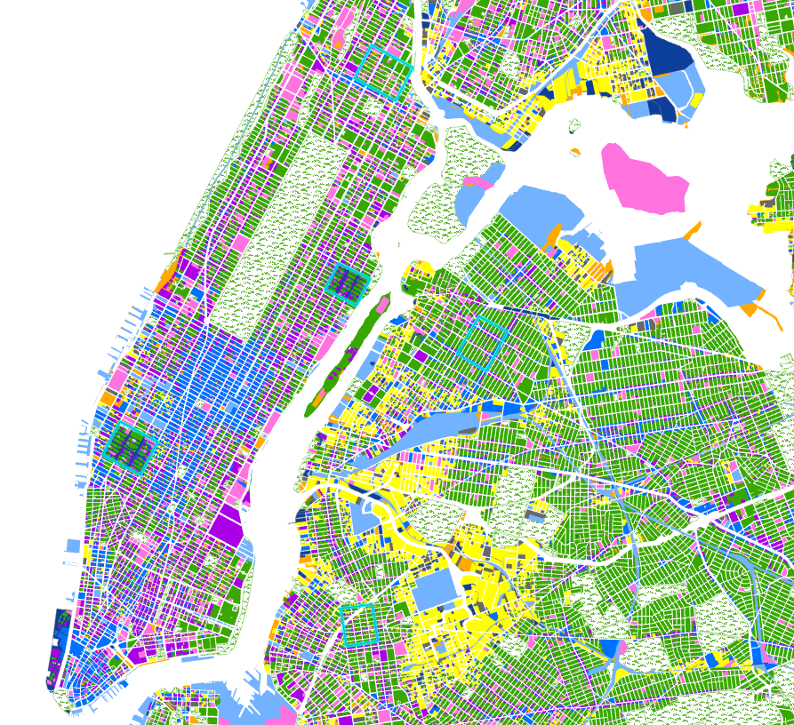
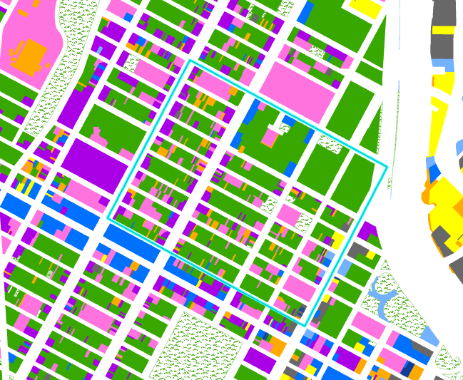
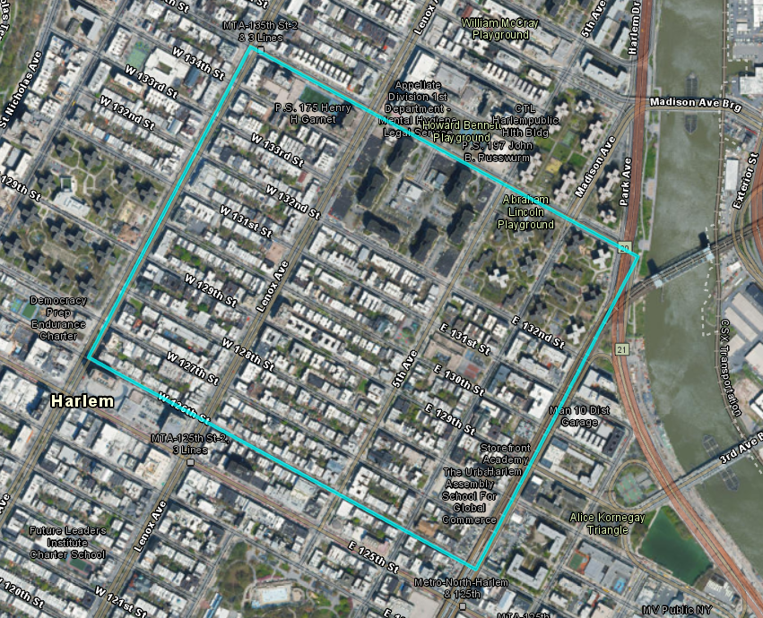
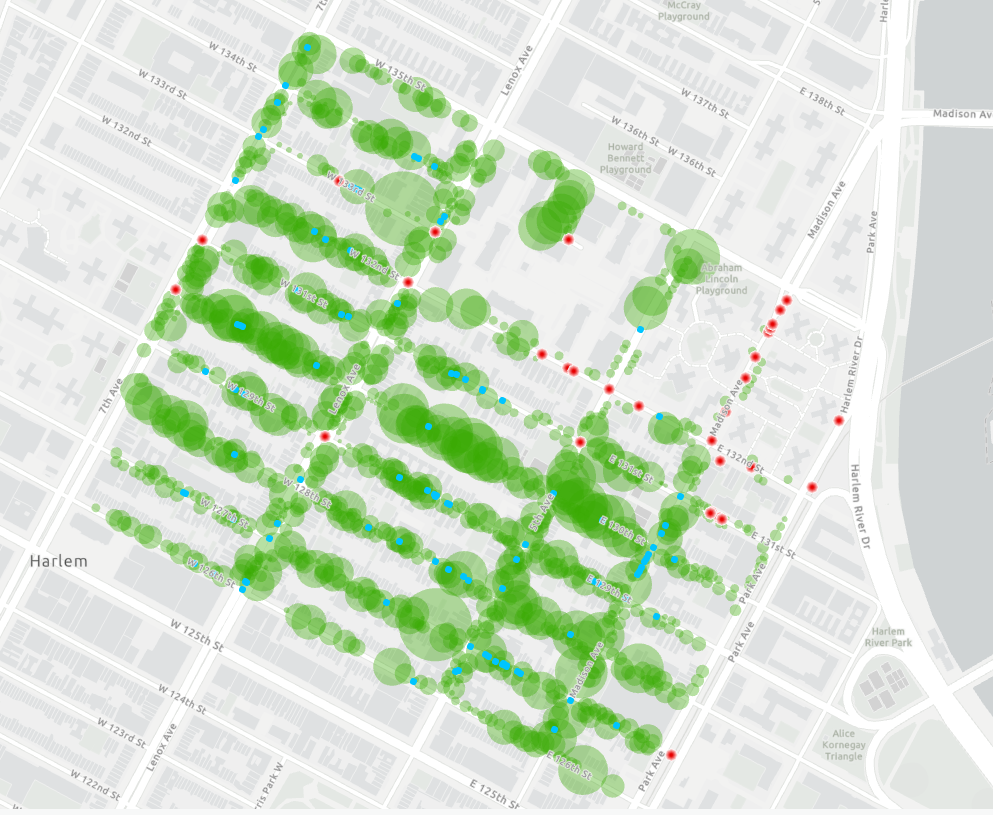
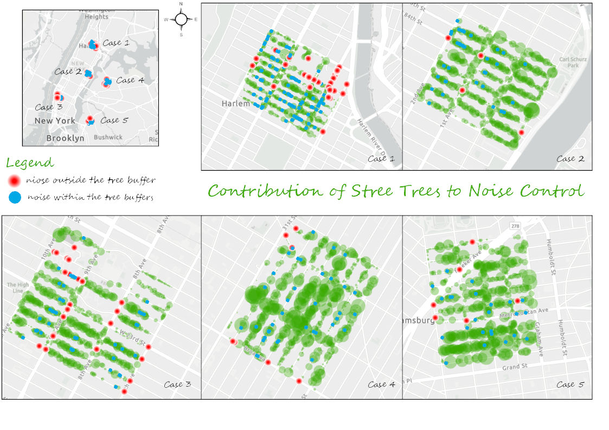
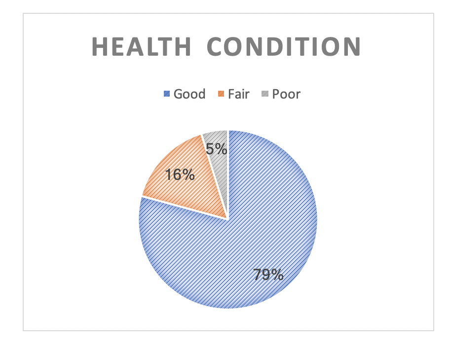
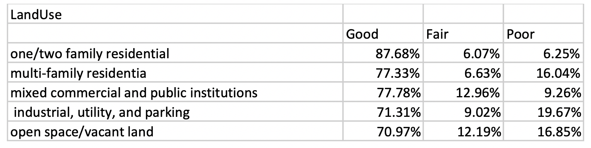

## 1.Introduction

As the process of urbanization accelerates, people are paying more and more attention to the ecological problems of cities. Urban forests are increasingly receiving attention as a means of mitigating major human and environmental health problems associated with rapidly urbanizing areas. Trees provide urban residents with welfare or “ecosystem services” including air purification, temperature regulation, noise reduction, carbon sequestration, rainwater management, and recreation. Therefore, trees play the role of the city's “green infrastructure”. However, they can also cause "damage", such as the release of volatile organic compounds, causing pollen allergy and damage to infrastructure. An important part of urban forest research is to understand and quantify these services and relationships in order to improve them through proper management, including planting and caring for urban trees. Over time,  urban forest management and green infrastructure planning will be benefited after determining urbanization trends and the accompanying growth and decline of urban forests.

## 2.Theme Review

Understanding how biological, social, and urban design factors impact the health condition of street trees and the establishment of new young trees. This notebook will focus on the different growth conditions of street trees and how these trees affect the noise pollution. This notebook tries to find some spatial patterns of noise in the urban area and the correlations with trees living conditions. Offer some advice for further urban forest work.

## 3.Data and Methods

Data: 1) NYC Street Tree Census 2)  NYC Noise Complaints 3) NYC Land Use 

### a.Statistics Analysis and Data Visualization

This part use R for Statistics analysis and make some plots.
```{r}
# set working path
getwd()
setwd('/Users/afen/Documents/GitHub/Contribution_of_The_Urban_Forest_to_Noise_Control_Based_NYC')
```

```{r}
# load data
# data resource: hhttps://data.cityofnewyork.us/Environment/2015-Street-Tree-Census-Tree-Data/
tree_census_data <- read.csv('./data/census/new_york_tree_census_2015.csv')
head(tree_census_data)
names(tree_census_data)
```
```{r}
library(ggplot2)
library(scales)
```

```{r}
#count the dead trees
sum(tree_census_data$status == 'Dead'| tree_census_data$status =='Stump')
```

```{r}
# select the interesting columns 
tree_census_data_Alive <- subset(tree_census_data,(tree_census_data$status == 'Alive'))
tree_census_data_Alive <- subset(tree_census_data_Alive,select = c("tree_id","health","spc_latin","spc_common","address","boroname","latitude","longitude","x_sp","y_sp"))
tree_census_data_Alive <- subset(tree_census_data_Alive,(tree_census_data_Alive$tree_id != 245041))
```

```{r}
# plot the number of different kinds of trees
tree_spc_health_plot <- ggplot(tree_census_data_Alive,aes(spc_common))
tree_spc_health_plot + geom_bar(aes(fill=health)) + scale_fill_brewer(direction = -1,palette = "Green") + theme(axis.text.x = element_text(colour="grey20",size = 5,angle=45,hjust=.5,vjust=.5,face="plain"))
```
```{r}
# plot the health condition of different boroughs
ggplot(tree_census_data_Alive,aes(boroname)) + geom_bar(aes(fill=health)) + scale_fill_brewer(direction = -1,palette = "Green")
```


```{r}
# select interesting area the number of street tree is too large.
tree_census_data_B <- subset(tree_census_data_Alive,(tree_census_data_Alive$boroname == 'Brooklyn'))
tree_census_data_M <- subset(tree_census_data_Alive,(tree_census_data_Alive$boroname == 'Manhattan'))
```

```{r}
head(tree_census_data_M)
```


```{r}
# import the noise data
Noise_data <- read.csv('./data/census/NYC_Noise.csv')
head(Noise_data)
names(Noise_data)
```
```{r}
# select interesting columns
Noise_data <- subset(Noise_data,select = c("OBJECTID","Descriptor","Resolution","Borough","Latitude","Longitude"))
```

```{r}
# plot the number of different reasons for noise complains in different borough.
ggplot(Noise_data,aes(Descriptor)) + geom_bar(aes(fill=Borough)) + scale_fill_brewer(direction = -1,palette = "Green") + theme(axis.text.x = element_text(colour="grey20",size = 5,angle=45,hjust=.5,vjust=.5,face="plain"))
```

This part do spatial visualization by ggmap.

```{r warning=FALSE,message=FALSE}
library(ggmap)
```

get your own key https://console.cloud.google.com/google/maps-apis/
```{r}
register_google(key = "{your google key}")
```

```{r}
# plot the street trees and noise compalints in a small area of Manhattan.
ManhattanT <- get_map(location = c(-73.971,40.748), zoom = 17, color = 'bw')
ggmap(ManhattanT) + geom_point(data = tree_census_data_M, aes(x = longitude, y = latitude, colour = 'blue')) + geom_point(data = Noise_data,aes(x = Longitude, y = Latitude, colour = 'red'))
```
```{r}
# plot the street trees and noise compalints in a small area of BrooklynT.
BrooklynT<- get_map(location = c(-73.997,40.693), zoom = 17, color = 'bw')
ggmap(BrooklynT) + geom_point(data = tree_census_data_B, aes(x = longitude, y = latitude, colour = 'blue')) + geom_point(data = Noise_data,aes(x = Longitude, y = Latitude, colour = 'red'))
```

### b.Spatial analysis

This part I will do some work to find the contribution of street trees to noise control and the living condition of street trees by Arcgis pro. 

#### i).Study areas

Because the number of street trees in New York is too large to do some detailed research. I select 5 study area from Manhattan and Brooklyn. The majority of land use of these areas are residential areas and far away from parks or other areas with natural forest. which can reduce other trees effect and help us concentrate on the effect of street trees.


The Land use detail of the study area (case 1)



The sateillte image of case1.



#### ii).The contribution of street trees to noise control

Buffer the points of street trees. The buffer distance decided by the attribution of trees called "tree_dbh". As we know the noise control capability is related to the canopy area of the street tree. "tree_dbh" refer to the diameter of the trunk or bole of a standing tree which highly correlated to the canopy area of trees.

python buffer code

arcpy.analysis.Buffer("c2015StreetTreesCensus_TREES1",r"D:\00-Temp\18087325g\LSGI_545_Student_Revised\NYC_Revised.gdb\c2015StreetTreesCensus_TREES2", "tree_dbh", "FULL", "ROUND", "NONE", None, "PLANAR")


Use location select tool to differ the points of noise complian to within the buffers and outside the buffers.



Do the same operations to the rest of cases and make a theme map.



#### iii) The effect land use to street tree

For this analysis, observed land uses were grouped into five categories: one/two family residential; multi-family residential; mixed, commercial, and public institutions; industrial, utility, and parking; and open space/vacant land. We would like to find the effect of land use to the living condition of street trees.

Same as before we do buffers of different type of land use and mark the trees.And then we list de table for the health of trees in different land use buffers.

python buffer code

arcpy.analysis.Buffer(" LandUse_Parcels_CopyFeatures",r"D:\00-Temp\18087325g\LSGI_545_Student_Revised\NYC_Revised.gdb\ LandUse_Parcels_CopyFeatures_buffer", "10", "FULL", "ROUND", "NONE", None, "PLANAR")





## 4. Results and Conclusion

* Results

a. As for the contribution of street trees to noise control, it seems there are still many noise complain points with the tree buffers. There is not hard rule like trees completely deal with the noise problem. We all know that there are many other factors that can affect the noise problem. But we still can find some patterns about the noise complain distribution. For example, there are many noise complain points concentrate together at the top-right corner in Case1. And we can find that the greater the density of trees, the lower the noise. For example, there are less noise complain at the middle part of Case4 and left-bottom area of Case5.

b. How land-use type affect the health condition of the street trees? From the table, we can find that different land-use type seems to affect the street trees living condition. Human behavior can affect the urban forest. Monitoring the growth of trees in different land-use types can provide better ways for the relevant departments to maintain trees. It seems the trees in the industrial area have lower good rate than those in the residential area. The reason may be that the pollution effect trees. Without more detailed data, we just list the results. But this information can be helpful to develop urban forest.

* Strategies

a. As for the noise complaints, we should more focus on the residential area and official area. These parts have a larger population density. And noise problem can directly affect people work and rest. From the results, trees do reduce noise affection. Planning more trees in the area that have high noise complain rate.

b. On the other hand,strengthening field research and finding factors affecting tree health for land-use types where trees are in poor health.Field research data makes more sense for analyzing the health of trees.

## 5.	References

 * Bolund, & Hunhammar. (1999). Ecosystem services in urban areas. Ecological Economics, 29(2), 293-301.
 
 * Bucur, V. (2006). Urban forest acoustics. Berlin: Springer-Verlag.
 
 * Foster, R.S. and J. Blaine. 1978. Urban tree survival: trees in the sidewalk. Journal of Arboriculture 4(1): 14-17.
 
 * Data Visualization with ggplot2 Cheat Sheet [https://www.rstudio.com/wp-content/uploads/2015/03/ggplot2-cheatsheet.pdf]
 
 * Arcpy 
 [https://pro.arcgis.com/zh-cn/pro-app/arcpy/get-started/installing-python-for-arcgis-pro.htm]
 
### Author information
 * Author: zhoumaneo
 * Resource: [https://github.com/zhoumaneo/Contribution_of_The_Urban_Forest_to_Noise_Control_Based_NYC]